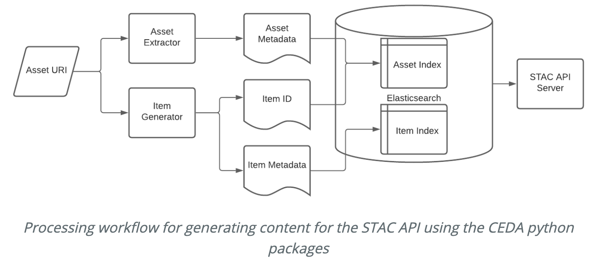

# CEDA Technical Blog

Blog to publish informal and technical articles about activities at CEDA.

Contents:
- [Orientation](#orientation)
- [Quickstart](#quickstart)
- [Branch naming convention](#branch-naming-convention)
- [Getting started with Jekyll](#getting-started-with-jekyll)
- [Writing and article](#writing-an-article)
- [Template includes](#includes)
- [Useful resources](#useful-resources)

## Orientation

The purpose of this blog is to publish information about activites at CEDA which might
be interesting for others to know about. The approach is less formal and provides a space
where we can talk about experimental and unfinished projects. The original motivation
for this was to share a project with interested external partners and provide space to explain
the reasons for certain decisions.

The blog posts are written using the [Jekyll](https://jekyllrb.com/) framework.
This is a static website writing framework which uses markdown and [liquid](https://jekyllrb.com/docs/liquid/) (a templating
syntax similar to jinja).

Blog posts are written in the `_posts` directory in [markdown](https://www.markdownguide.org/basic-syntax/) format. Posts can be
assigned categories by putting them in subfolders. For example, data management articles
could be put under `_posts/data_management`. The categories will then become part of the
url and can be used to group related articles together. 

Changes to the blog are pushed to their own branch and merged, via github pull request
to the `gh-pages` branch. Github then builds the blog and publishes it.

## Quickstart

Can be done in one of two ways:
- [Locally](#setup-environment-on-your-laptop)
- [On GitHub](#using-github-to-write-your-articles)

### Setup environment on your laptop

1. `git clone https://github.com/cedadev/dev-blog`
2. `cd dev-blog`
3. `git checkout gh-pages`
4. `git checkout -b article/<article-bramch-name>` following [branch naming convention](#branch-naming-convention)
5. Copy the [example article](https://raw.githubusercontent.com/cedadev/dev-blog/gh-pages/_drafts/example_blog_post.md) in the `_drafts` directory
6. Place the copy in the `_posts` directory, under your chosen category. If the category doesn't
exist, you'll have to make it.
6. [Start writing](#writing-an-article)

If you want to be able to see the effect of you edits in real time, you'll want to 
look at [installing jekyll](#getting-started-with-jekyll). As articles are written
in markdown, you don't need to use Jekyll but it might be useful if you are also using
diagrams.

### Using GitHub to write your articles

As this is a static site built using Markdown, you can write your articles in GitHub.

To do this:

1. [Navigate to the `gh-pages` branch `_posts` directory](https://github.com/cedadev/dev-blog/tree/gh-pages/_posts)
2. Navigate to your chosen category directory. If you desired category doesn't exist, you will need to [clone the repo and
    add it](#setup-environment-on-your-laptop).
3. Click add file and create new

4. Copy the [example article](https://raw.githubusercontent.com/cedadev/dev-blog/gh-pages/_drafts/example_blog_post.md).
5. Paste into the editor window
6. At the bottom, change to "Create new branch" and use the [branch naming convention](#branch-naming-convention).

7. [Start Writing](#writing-an-article)


## Branch naming convention

`article/<article-topic-slug>`

e.g. `article/data-archiving-teqniques`

## Getting started with Jekyll

The jekyll documentation gives a [quick start guide](https://jekyllrb.com/docs/#instructions) to setting up Jekyll. It uses ruby
to provide local server which you can use when developing your articles.

## Installing Jekyll

This is a quick guide to installing Jekyll on a mac. If you're installing on windows see the [jekyll docs](https://jekyllrb.com/docs/installation/windows/).

You'll need to install:
- Ruby version 2.5.0 or higher (check this with `ruby -v`).
- RubyGems (check with `gem -v`)
- GCC and Make

This is generally easiest with homebrew, see the [jekyll docs](https://jekyllrb.com/docs/installation/macos/) or the [mac install guide](https://mac.install.guide/ruby/index.html) if you're having trouble with this. You can also use rbenv if you need to manage multiple versions of ruby. 

In any case, once ruby is installed and added to your path, you can now install Jekyll and Bundler. This is probably best done locally (there are instructions on the docs to install globally if that's your jam). 
```
gem install --user--install bundler jekyll
```
And then similarly add it to your path
```
# If you're using Zsh
echo 'export PATH="$HOME/.gem/ruby/X.X.0/bin:$PATH"' >> ~/.zshrc

# If you're using Bash
echo 'export PATH="$HOME/.gem/ruby/X.X.0/bin:$PATH"' >> ~/.bash_profile

``` 
where X.X.0 is replaced with your version of ruby. As a quick sanity check, run 
```
gem env
```
and make sure that `GEM PATHS:` points to your home directory. 

As a final installation step you'll need to download and (locally) install the gems needed to serve the website. Go to the directory where you've checked out the `gh-pages` branch and run:

```
bundle config set --local path 'vendor/bundle'
bundle install
```
You can of course edit the first line if you'd like to install into a directory other than `vendor/bundle`, or omit it entirely if you'd like to install globally. 

You should now be free to start your local server with the command 
```
bundle exec jekyll serve 
```
whereby you can now access your local copy of the blog at [http://localhost:4000](http://localhost:4000).

## Writing an article

- [Article structure](#article-structure)
- [Adding images](#article-assets-images-and-such)
- [Linking other posts](#linking-to-other-posts)
- [Adding author bio](#author-bio)

You should follow good git practice and develop your articles on a branch. Merging to `gh-pages` is 
protected and requires 1 approving review from senior management, just as a final check. Please use
the [naming convention](#branch-naming-convention) for your branches. Setting up
you environment to write an article is covered in [quickstart](#quickstart) and can be done [locally](#setup-environment-on-your-laptop)
or in the [GitHub interface](#using-github-to-write-your-articles).

Articles are written in markdown. The content is up to you although it makes sense to follow
a [common structure](#article-structure). Feel free to get technical. Think about the audience
you are trying to reach.

The section at the top of the article is called [front matter](https://jekyllrb.com/docs/front-matter/).
You will need to fill in values for some of the front matter. i.e. `Author`, `date`, `tags`, `title`
```
---
layout: post
title:  "Search Futures"
author: Richard Smith
date:   2021-07-05 17:00:00 +0100
tags: search indexing stac
---
```

Using Jekyll's Liquid templating language, you can make use of various includes to aid in your
post formatting. [Current includes](#includes).

### Article Structure

Look at the example in the `_drafts` directory to get an idea of the structure.
[Example Article](https://raw.githubusercontent.com/cedadev/dev-blog/gh-pages/_drafts/example_blog_post.md)

### Article assets (images and such)

It is likely that you'll want to add images. Add your images to the `assets` directory.
Assets should be organised following the `_posts` structure. For example:

```
dev-blog/
├─ assets/
│  ├─ img/
│  │  ├─ data_management/
│  │  │  ├─ 2021-07-09-data/
│  │  │  │  ├─ amazing_img.png
├─ _posts/
│  ├─ data_management/
│  │  ├─ 2021-07-09-data.md

```

Images can be directly linked to using the normal markdown image link syntax:

``

For convenience, I have added a figure template. To add an image with a caption.

```
 
```

You can look inside the `_includes` directory for other includes and discover their
options. This is where you can also add your own includes.

### Linking to other posts

In order to link to other posts without worrying about broken links, use the `post_url`
tag.

```

```

### Author Bio

When you set the author at the top of your post, the template will try to find a matching
bio in [_data/authors.yaml](https://github.com/cedadev/dev-blog/blob/gh-pages/_data/authors.yaml).

Add your name to get it picked up. I used the image url and bio from [ceda.ac.uk](ceda.ac.uk)

## Includes

Includes are small template snippets which can be used to provide consistent results and 
reduce repetition when creating common elements. The available includes are below.

| Name | Description |
|------|-------------|
| [Figure](#figure) | Insert a figure into your article with a caption aligned centre underneath | 
| [Caption](#caption) | Standalone template to add a caption |
| [MathJax](#mathjax) | Allow support for Mathmatical formula renderer [Mathjax](https://www.mathjax.org/)|


### Figure

Renders an image with a caption centre-aligned below.
Defaults to be 50% of article width.



#### Configuration

| Option | Description |
|------|-------------|
| image_url | `required` URL to the image, can be an asset or external link |
| description | `required` Caption to be placed under image |
| image_style | modifies the style for the image. default: `width: 50%; margin-left: auto; margin-right: auto; display: block`

### Caption

Standalone text caption

#### Configuration
| Option | Description |
|------|-------------|
| description | `required` Caption to be generated |

### Mathjax

Mathmatical formula support can be enabled for your blog posts by adding 
`use_math: true` to your [front matter](https://jekyllrb.com/docs/step-by-step/03-front-matter/) at the top of the page 


## Useful Resources

- [Markdown Syntax Guide](https://www.markdownguide.org/basic-syntax/)

